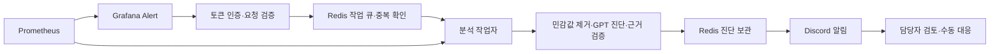

# Grafana → Spring Boot → GPT → Discord

Grafana 알림을 공유 토큰으로 인증하고 Redis에 작업을 저장한 뒤 `202 Accepted`를 반환한다. 작업자는 같은 대상의 Prometheus 지표를 수집하고, 기존 진단 엔진으로 원인 후보를 분석해 Discord로 전달한다. [기존 CLI](INCIDENT_DIAGNOSIS_MVP.md)는 과거 자료와 시뮬레이션 검증에 계속 사용할 수 있다.



## 실행 설정

기존 Spring Boot 실행 환경, Redis, Prometheus, OpenAI API 키와 Discord Webhook을 준비한다. 저장소는 BWLOVERS-BE이므로 첨부 예시의 YBC 호스트명을 하드코딩하지 않는다. 다음 설정은 `incident` 프로필을 추가했을 때만 활성화된다.

| 환경 변수 | 설명 |
| --- | --- |
| `INCIDENT_ALERT_TOKEN` | Grafana 수신/작업 조회/재시도용 공유 토큰. 영문·숫자·`_`·`-`, 32~256자 |
| `INCIDENT_METRICS_TOKEN` | Prometheus scrape용 별도 토큰. 같은 길이/문자 규칙이며 알림 토큰과 달라야 함 |
| `INCIDENT_PROMETHEUS_URL` | 서버에서 접근하는 Prometheus URL. 기본 `http://localhost:9090` |
| `INCIDENT_PROMETHEUS_TOKEN` | Prometheus 조회 인증이 필요한 경우 Bearer 토큰 |
| `INCIDENT_PROMETHEUS_JOB` | 허용할 Prometheus job. 기본 `bwlovers` |
| `INCIDENT_DB_POOL` | 기본 풀 이름. 기본 `HikariPool-1`; 프로필에서 Hikari 풀 이름도 동일하게 설정 |
| `INCIDENT_OPENAI_API_KEY` | 진단용 키. 미지정 시 기존 `OPENAI_API_KEY` 사용 |
| `OPENAI_INCIDENT_MODEL` | 기본 `gpt-4.1-mini` |
| `DISCORD_INCIDENT_WEBHOOK_URL` | 일반 텍스트 채널의 Webhook URL |
| `INCIDENT_WORKER_ENABLED` | 기본 true. 수신 전용 인스턴스에서는 false; 별도의 작업자가 필요 |

키를 환경 변수에 설정한 터미널에서 기존 앱의 프로필에 `incident`를 추가한다.

```bash
cd bwlovers
./gradlew bootRun --args='--spring.profiles.active=local,incident'
```

CLI의 `incidentDiagnosis` 작업은 Spring 프로필을 읽지 않는다. 프로필을 사용하지 않으면 Webhook·조회·재시도 API와 `/actuator/prometheus`는 404로 차단된다. 기존 사용자 JWT 인증과 운영용 공유 토큰을 분리했다. 알림 토큰은 **GPT 호출·알림 재시도를 유발할 권한**이 있으므로 Grafana와 담당자의 환경에만 설정한다.

## Prometheus와 Grafana

1. [Prometheus 설정 예시](incident/monitoring/prometheus.example.yml)의 대상 주소와 토큰 파일 절대 경로를 실제 환경에 맞게 수정한다. 파일 내용은 `INCIDENT_METRICS_TOKEN` 값이다. Prometheus를 컨테이너로 실행하면 `localhost`는 그 컨테이너 자신이므로 앱에 접근 가능한 주소를 사용한다.
2. `/actuator/prometheus`에 `Authorization: Bearer <INCIDENT_METRICS_TOKEN>`으로 접근하는 scrape를 설정한다. Spring 프로필은 HTTP 지연 histogram과 SLO 버킷을 활성화한다. [Spring Boot 3.5 Metrics 문서](https://docs.spring.io/spring-boot/3.5/reference/actuator/metrics.html)를 기준으로 구성했다.
3. [Grafana 데이터소스 예시](incident/monitoring/grafana-datasource.example.yml)를 `provisioning/datasources/`에, [알림 규칙 예시](incident/monitoring/grafana-alerts.example.yml)를 `provisioning/alerting/`에 적용한다. URL과 job을 변경했다면 규칙도 함께 수정한다. 데이터소스 UID는 `incident-prometheus`다.
4. Grafana Contact Point에 Webhook을 추가한다. URL은 `https://<백엔드 호스트>/internal/ai-incidents`, 메서드는 POST다. Authentication Header Scheme은 `Bearer`, Credentials는 `INCIDENT_ALERT_TOKEN`으로 지정한다. 대안으로 Extra Headers의 `X-Alert-Token`도 지원한다. URL에 토큰을 넣지 않는다.
5. `team=incident`인 알림을 이 Contact Point로 보내는 Notification Policy를 추가한다. `job`과 `instance`로 그룹화하고, Max Alerts는 0으로 설정한다. 서버는 한 요청당 최대 20건을 받으므로 큰 그룹은 더 나눠야 한다. 잘린 알림은 무시하지 않고 거부한다.

공유 토큰 인증을 구현했으며 HMAC 검증은 포함하지 않았다. Grafana의 인증 헤더와 기본 JSON 형태는 [공식 Webhook 문서](https://grafana.com/docs/grafana/latest/alerting/configure-notifications/manage-contact-points/integrations/webhook-notifier/)에서 확인했다. resolved 요청은 접수하되 GPT 분석을 만들지 않는다. Grafana의 기본 Test 버튼은 job/instance 없는 가짜 알림을 보낼 수 있으므로, 연결 검증에는 아래 예시 또는 실제 규칙을 사용한다. DatasourceError 등 대상 label이 없는 알림은 일반 운영 알림 경로로 보낸다.

| 알림 | 예시 조건 | 의미 |
| --- | --- | --- |
| HIGH_JVM_HEAP | 유효 Heap 풀 사용률 >85%, 5분 유지 | JVM Heap 압박 가능성 |
| HIGH_REQUEST_LATENCY | 최근 5분 P95 >0.8초, 5분 유지 | API 응답 지연 |
| HTTP_429 | 최근 5분 애플리케이션 429 추정치 >0 | 요청 거부 관측 |
| HIGH_DB_POOL | 같은 풀의 active/max >80%, 5분 유지 | 풀 여유 감소 |

Heap 식은 `max=-1` 등 한도를 알 수 없는 풀을 제외한 뒤 job/instance별로 합산한다. P95도 job/instance를 유지한다. 서로 다른 프로세스와 연결 풀의 값을 하나로 섞지 않는다. 임계치는 시작점이며 실제 부하를 바탕으로 조정한다. 예시의 NoData는 OK이므로 scrape 대상 중단을 감지하려면 별도 가용성 알림을 운영해야 한다.

## 수집 범위와 한계

분석 구간은 **Webhook 수신 시각 직전 5분**이다. 최초 알림 시작 시각은 `alertStartedAt`에 별도로 기록한다. 반복 알림의 `startsAt`은 오래된 시각일 수 있고 즉시 진단에서는 미래 5분을 조회할 수 없으므로 수신 시각을 기준으로 고정한다. 작업이 지연되어도 모든 쿼리는 같은 고정 시각을 사용한다. P95 비교 기준은 그 직전의 동일 길이 5분이다.

Prometheus instant query API를 사용하며, 여러 대상 시계열·부분 결과 경고·빈 값·NaN은 미수집으로 처리한다. [Prometheus HTTP API](https://prometheus.io/docs/prometheus/latest/querying/api/)를 따른다. `increase`는 외삽 때문에 소수가 될 수 있으므로 반올림한 실제 건수로 표시하지 않고 `countValuesEstimated=true`로 남긴다. [Prometheus increase 설명](https://prometheus.io/docs/prometheus/latest/querying/functions/#increase)을 참고한다.

| 수집됨 | 현재 미수집 |
| --- | --- |
| 애플리케이션 요청량, 429/5xx 추정치 | 플랫폼에서 애플리케이션 도달 전에 거절한 Cloud Run 429 |
| 현재/직전 구간 P95(초) | Cloud Run 리비전·활성/최대 인스턴스 |
| JVM Heap 사용량/한도(MiB) | 컨테이너 전체 메모리 사용량/한도 |
| 동일 Hikari 풀의 active/max | Cloud Logging 원본 로그 |

JVM Heap 값을 `memoryUsageMb`에 넣지 않고 `jvmHeapUsageMb`에 기록한다. 컨테이너 메모리·인스턴스 값은 null이다. 로그는 빈 배열과 수집 한계 설명으로 남긴다. 따라서 Heap 알림만으로 컨테이너 메모리 장애가 확인됐다고 설명하지 않는다. 첨부안의 Cloud Logging 자동 수집은 후속 단계이며, 과거 로그를 포함한 분석은 기존 CLI로 수행한다. 모든 지표를 수집하지 못했다면 GPT를 호출하지 않고 작업을 FAILED로 기록한다.

알림의 외부 URL, annotation 안의 지시문, values의 A/B/C를 임의의 수집 URL·쿼리·관측 로그로 사용하지 않는다. 등록된 job과 검증한 instance/pool label로만 고정된 PromQL을 생성한다. 주요 비밀 값, OAuth 인가 코드, DB 접속 문자열을 제거하고, 진단의 근거 값이 실제 입력과 일치하는지 확인한다.

## API 명세

모든 운영 API는 `X-Alert-Token` 또는 `Authorization: Bearer <INCIDENT_ALERT_TOKEN>`으로 인증한다. 두 헤더가 있으면 X-Alert-Token을 사용한다. Content-Type은 POST에서 `application/json`이어야 한다.

| 메서드·경로 | 요청 | 정상 응답 |
| --- | --- | --- |
| `POST /internal/ai-incidents` | Grafana 기본 Webhook JSON, 최대 64 KiB·20 alerts | 202, jobs와 ignoredResolved |
| `GET /internal/ai-incidents/{jobId}` | 경로의 SHA-256 ID | 200, 상태·진단·전송 결과 |
| `POST /internal/ai-incidents/{jobId}/retry` | `{"deliveryChecked":true}` | 202 QUEUED |

[요청 예시](incident/grafana-webhook.example.json)의 job/instance를 실제 scrape 대상에 맞춰 수정한 뒤 전송한다. 이 파일은 연결 테스트용 알림이며 실제 과거 장애 자료가 아니다.

```bash
curl --fail-with-body -X POST http://localhost:8080/internal/ai-incidents \
  -H "X-Alert-Token: ${INCIDENT_ALERT_TOKEN}" \
  -H 'Content-Type: application/json' \
  --data-binary @docs/incident/grafana-webhook.example.json
```

응답 예시(식별자는 설명용):

```json
{
  "ignoredResolved": 0,
  "jobs": [{"jobId": "<64자리 SHA-256>", "status": "QUEUED", "created": true}]
}
```

202는 작업이 저장됐다는 의미이며 진단·Discord 전송 성공을 뜻하지 않는다. 같은 label 집합과 startsAt의 알림은 보관 기간 안에서 같은 jobId를 반환하며 `created=false`다. 같은 label이어도 startsAt이 바뀌는 새로운 장애는 새 작업으로 처리한다. 그룹에 잘못된 알림이 있거나 용량을 초과하면 신규 작업을 일부만 저장하지 않는다.

```bash
curl --fail-with-body http://localhost:8080/internal/ai-incidents/<jobId> \
  -H "X-Alert-Token: ${INCIDENT_ALERT_TOKEN}"

# 실패 상태와 Discord 채널을 확인한 후에만 실행
curl --fail-with-body -X POST http://localhost:8080/internal/ai-incidents/<jobId>/retry \
  -H "X-Alert-Token: ${INCIDENT_ALERT_TOKEN}" \
  -H 'Content-Type: application/json' \
  --data '{"deliveryChecked":true}'
```

| 상태 | 의미 |
| --- | --- |
| QUEUED | Redis 저장 완료, 대기 중 |
| PROCESSING | 지표 수집·GPT 분석 중 |
| ANALYZED | 진단을 Redis에 저장함 |
| DELIVERING | Discord 전송 시도 기록 완료 |
| SENT | Discord 메시지 ID 확인 완료 |
| FAILED | 수집·분석·저장 단계 실패 또는 작업자 복구 횟수 초과 |
| DELIVERY_UNKNOWN | Discord 성공 여부를 확인할 수 없음. 채널 확인 필요 |

| HTTP 상태 | 의미 |
| --- | --- |
| 400 | 잘못된 JSON·status·대상 label·잘린 alerts·미확인 재시도 요청 |
| 401 | 운영용 인증 토큰 누락/불일치 |
| 404 | 기능 비활성 또는 작업이 없거나 보관 기간 만료 |
| 409 | 재시도할 수 없는 상태 또는 재시도 큐 용량 초과 |
| 413 | 요청 본문 64 KiB 초과 |
| 429 | 작업 큐 최대 100건 초과. Retry-After: 60 |
| 503 | Redis 저장 실패. 202를 반환하지 않음 |

## 보관·재시도·운영 조건

작업·진단·중복 방지 정보는 Redis에 24시간 보관하며 단계 갱신 때 TTL을 연장한다. 보관 기간이 지나면 같은 장기 알림이 다시 분석될 수 있다. 실험 자료는 만료 전에 GET 응답의 report를 파일로 저장한다. 자동 수집 report의 `measurementInput`은 CLI에서 사용할 입력이고 해시는 report의 inputSha256과 일치한다.

작업자마다 동시에 하나의 작업을 처리한다. Redis Lua로 소유권을 획득하고 10분 lease를 사용한다. 중단된 분석은 최대 3회 claim까지 복구할 수 있어 GPT 응답을 받았지만 저장 전 중단된 경우 API 호출이 반복될 수 있다. 이미 저장한 reportJson은 복구·담당자 재시도 시 재사용한다. Discord 전송 직전에 DELIVERING을 저장하며, 이 단계의 lease가 끝나면 자동 재전송하지 않고 DELIVERY_UNKNOWN으로 전환한다. 이는 정확히 한 번 전송을 보장하는 시스템은 아니다.

Redis 서버가 재시작된 후에도 작업을 보존하려면 해당 Redis의 persistence와 비퇴거 보관 정책이 필요하다. 이 코드는 기존 Redis 설정을 변경하지 않는다. 사용 중인 Redis가 캐시 데이터와 함께 작업 키를 퇴거시키면 중복 방지나 보관이 유지되지 않을 수 있다.

Cloud Run의 요청 기반 CPU 환경에서는 응답 뒤의 작업자 실행을 보장할 수 없다. 항상 실행 가능한 별도 작업자나 인스턴스 기반 CPU 설정과 최소 인스턴스가 필요하다. 실제 적용은 담당자가 검토한다. [Cloud Run billing 설정](https://docs.cloud.google.com/run/docs/configuring/billing-settings)을 참고한다. 이 변경은 CPU·인스턴스 설정, 배포나 실제 장애 대응을 자동으로 수행하지 않는다.

## 검증 범위

단위 테스트 외에 실제 임시 Redis 프로세스에서 동시 enqueue, 중복 방지, 그룹 원자성, lease 복구, 만료된 작업자 차단, 전송 불명 상태와 재시도를 검증한다. `redis-server`가 PATH에 있어야 하며 없으면 해당 테스트만 건너뛴다. Spring 통합 테스트는 H2와 가짜 작업 저장소를 사용해 토큰 인증, 큐 실패 응답, 기능 비활성화, 실제 Actuator 메트릭 노출을 확인한다. GPT·Discord는 테스트 대역으로 검증한다.

```bash
cd bwlovers
./gradlew test bootJar
```

Grafana 규칙 파일은 연결 설정 예시다. 실제 Grafana→운영 Prometheus→GPT→Discord 전체 연결 검증, Cloud Logging 자동 수집과 성과 수치 측정은 아직 완료하지 않았다. 자료 출처는 SIMULATION/HISTORICAL/LIVE로 구분하고, 1순위 후보·근거의 타당성·불필요한 조치는 담당자가 검토한 뒤에만 성과로 기록한다.
