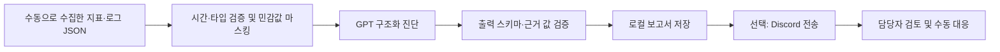

# 장애 진단 AI MVP

동일 시간대의 운영 지표·로그를 OpenAI에 전달하고, 검증한 진단을 Discord에 제공한다. 기존 Java CLI는 서버·DB 없이 실행할 수 있다. 새 Grafana Webhook 경로는 Spring Boot API, Redis 작업 큐, Prometheus 수집기를 사용한다. 연결 방법은 [Grafana 연동 안내](GRAFANA_INCIDENT_WEBHOOK.md)를 참고한다.



현재 제공하는 네 사례는 **모두 합성한 시뮬레이션 데이터**다. 실제 과거 장애 검증, 실제 GPT 진단의 후보 일치율, Discord 실전송, 담당자 분석 시간 단축 수치는 아직 측정하지 않았다. 자동 테스트의 가짜 AI 응답과 시간 값은 프로그램 검증용이며 성과 수치로 사용할 수 없다.

## 빠르게 실행하기

저장소 루트에서 시작한다. 프로젝트의 Java 17 toolchain과 Gradle wrapper를 사용한다. 서버의 모니터링에는 Actuator와 Prometheus registry 의존성을 추가했다.

```bash
cd bwlovers
./gradlew incidentDiagnosis --args='--help'

# 키 없이 입력 검증과 외부에 전달될 요청 확인
./gradlew incidentDiagnosis --args='analyze --input ../docs/incident/scenarios/memory-exceeded.json --output ../docs/incident/runs/memory-preview --dry-run'
```

`runs/memory-preview/request.json`에서 마스킹된 입력과 프롬프트를 확인한다. `--dry-run`은 네트워크 요청과 AI 진단을 수행하지 않는다. 출력 디렉터리는 매번 새 경로여야 하며 기존 결과를 덮어쓰지 않는다.

실제 분석은 실행할 터미널 환경에 `OPENAI_API_KEY`를 설정한 뒤 수행한다. 기존 Spring의 `application.yml`이나 `.env` 파일은 CLI가 읽지 않는다.

| 환경 변수 | 용도 | 기본값 |
| --- | --- | --- |
| `OPENAI_API_KEY` | GPT 호출 인증 | 없음, 실제 분석 시 필수 |
| `OPENAI_INCIDENT_MODEL` | Responses API와 JSON Schema 출력을 지원하는 모델 | 기존 프로젝트와 같은 `gpt-4.1-mini` |
| `DISCORD_INCIDENT_WEBHOOK_URL` | 진단용 일반 텍스트 채널의 Discord Webhook | 없음, 전송 시 필수 |

```bash
# API 키를 설정한 터미널에서 실행
./gradlew incidentDiagnosis --args='analyze --input ../docs/incident/scenarios/memory-exceeded.json --output ../docs/incident/runs/memory-multi'

# Webhook 환경 변수를 설정한 뒤, 저장된 진단 전송 (GPT 재호출 없음)
./gradlew incidentDiagnosis --args='send --report ../docs/incident/runs/memory-multi/report.json --output ../docs/incident/runs/memory-multi/delivery.json'

# 분석과 전송을 한 번에 수행
./gradlew incidentDiagnosis --args='analyze --input ../docs/incident/scenarios/instance-capacity.json --output ../docs/incident/runs/instance-multi --send-discord'
```

Discord 전송은 `--send-discord` 또는 `send`를 지정한 경우에만 수행한다. Webhook은 `https://discord.com/api/webhooks/<id>/<token>` 형태를 사용한다. Forum/Media 채널 및 thread는 이 MVP 범위에 포함하지 않는다. 키와 Webhook URL을 CLI 인수나 저장소에 작성하지 않는다.

## 입력 데이터

[메모리 예제](incident/scenarios/memory-exceeded.json), [가용 인스턴스 예제](incident/scenarios/instance-capacity.json), [DB 풀 예제](incident/scenarios/db-pool.json)를 참고한다.

| 필드 | 의미 및 단위 |
| --- | --- |
| `incidentId` | 파일·측정 비교용 ID. 영문, 숫자, `.`, `_`, `-` 사용 |
| `sourceType` | `SIMULATION`, `HISTORICAL`, 또는 자동 수집한 `LIVE` |
| `evidenceReference` | 실제 장애의 원본 로그/관측 자료 위치와 설명. HISTORICAL일 때 필수. 모델 입력에서 제외 |
| `service`, `revision` | 수집 대상 서비스와 리비전. 혼합되거나 불명확하면 그 사실을 명시 |
| `windowStart`, `windowEnd` | offset이 있는 ISO-8601. 시작 포함·종료 미포함, 최대 24시간 |
| `metricScope` | 구간, 집계 방식, 메모리 인스턴스와 DB 풀 범위. 서로 다른 범위라면 명시 |
| `requestCount`, `status429Count`, `status5xxCount` | 해당 구간 요청 합계. 상태 코드 합계는 전체 요청 수 이하여야 함 |
| `p95Latency` | 해당 구간 P95 지연시간, **초**. 단일 평균값으로 대체하지 않음 |
| `memoryUsageMb`, `memoryLimitMb` | 같은 컨테이너의 사용량과 한도, **MiB**로 정규화 |
| `jvmHeapUsageMb`, `jvmHeapLimitMb` | JVM Heap 지표. 컨테이너 메모리와 구분 |
| `baselineP95Latency`, `baselineWindowStart`, `baselineWindowEnd` | 직전 동일 길이 구간의 P95 기준값(초)과 시각 |
| `countValuesEstimated` | true이면 요청·상태 코드에 Prometheus increase의 소수 추정치를 허용 |
| `collectionNotes`, `alertName`, `alertStartedAt` | 자동 수집 한계와 알림 메타데이터 |
| `activeInstanceCount`, `maxInstanceCount` | 해당 리비전의 관측 인스턴스 수와 적용 한도. 집계 방식은 metricScope에 명시 |
| `dbActiveConnections`, `dbMaxConnections` | **같은 애플리케이션 연결 풀**의 활성 연결과 풀 최대치. DB 전체 연결 한도와 혼합하지 않음 |
| `relatedLogs` | `{ "timestamp": "...", "message": "..." }` 배열. 로그 시각은 입력 구간 안에 있어야 함 |

관측되지 않은 지표는 필드를 생략하거나 `null`로 입력한다. `0`은 실제 관측값이다. 한도 `0`을 무제한/미설정의 뜻으로 사용하지 않는다. 미확인 한도는 `null`과 설명으로 남긴다. 입력 파일은 256 KiB 이하, 로그는 최대 100건·건당 2,000자다. 허용하지 않은 필드와 중복 JSON 키는 거부한다.

서비스·시간 구간이 같아도 각 지표의 최대값이 동시에 발생했음을 보장하지 않는다. 수집 담당자가 집계 범위를 확인하고 `metricScope`에 작성해야 한다. CLI는 타임스탬프 범위와 숫자 일관성을 검증하지만 콘솔 수치의 진위를 검증하거나 원본 지표를 자동 수집하지 않는다.

실제 장애를 추가하는 순서:

1. Cloud Run 콘솔 등에서 실제 장애 구간의 로그와 지표를 읽기 전용으로 추출한다.
2. [과거 장애 템플릿](incident/historical-template.json)을 `docs/incident/private/`에 복사한다. 템플릿은 미완성이므로 그대로 실행하면 검증에 실패한다.
3. `incidentId`, 서비스/리비전, 실제 시간대, 관측값, 로그 timestamp와 집계 설명을 작성한다. 템플릿의 날짜를 실제 장애 시각으로 교체한다.
4. `evidenceReference`에 관측 자료의 로컬 위치 등 확인 가능한 출처를 작성한다. 인증 URL이나 토큰은 적지 않는다.
5. 개인정보·업무 비밀을 제거한 뒤 `--dry-run` 결과를 검토하고 실제 분석을 실행한다.

`docs/incident/private/`, `runs/`, `measurements/`는 Git에서 제외한다. 다른 경로에 원본 로그와 결과를 저장하면 이 제외 규칙이 적용되지 않는다. URL, 인증 헤더, 흔한 비밀 키·토큰, 이메일, IPv4, 국내 휴대전화 형식을 마스킹하지만 정규식이 모든 민감정보를 제거하지는 못한다. 의료 정보 등 업무 데이터는 원본을 준비할 때 제거해야 한다.

## 출력과 권한 경계

진단 JSON의 최상위 필드는 다음 7개로 고정한다.

| JSON 필드 | 내용 |
| --- | --- |
| `anomalies` | 관측된 이상 현상 |
| `causeCandidates` | 코드, 설명, 참조 근거 경로를 가진 원인 후보 |
| `evidence` | 입력 JSON Pointer, 입력 값 그대로의 문자열, 해석 |
| `serviceImpact` | 서비스 영향 및 불확실성 |
| `additionalChecks` | 더 확인할 정보 |
| `recommendedActions` | 담당자가 검토하고 수동으로 수행할 대응 순서 |
| `confidence` | `LOW`/`MEDIUM`/`HIGH`와 근거 충분성 설명. 통계적 확률이 아님 |

수정 프롬프트 incident-v2는 원인 후보를 최대 3개까지 가능성 순으로 제시한다. 코드는 `MEMORY_PRESSURE`, `INSTANCE_CAPACITY`, `DB_POOL_EXHAUSTION`, `REQUEST_LATENCY`, `OTHER`, `INSUFFICIENT_DATA`다. REQUEST_LATENCY는 지연의 근본 원인이 아직 미확정임을 뜻한다. 429, 인스턴스 한도 1, 풀 사용률 100%만으로 원인을 확정하지 않도록 지시한다. 로그만 하나 입력했을 때 확신도가 LOW가 아니면 결과를 거부한다.

`evidence.field`는 `/memoryUsageMb` 등 지표 경로 또는 `/relatedLogs/0/message` 형태여야 한다. `evidence.value`가 실제로 전달한 입력과 다르거나, 누락한 지표를 참조하거나, 후보가 존재하지 않는 근거를 참조하면 저장·전송을 중단한다. 예를 들어 입력값이 531인데 AI가 999를 근거로 반환하면 실패한다. **값의 일치를 검증하는 기능이며, AI의 인과 해석과 자유 문장 전체를 사실로 보증하지는 않는다.**

| 생성 파일 | 용도 |
| --- | --- |
| `request.json` | 마스킹된 실제 요청. 입력에 정답, 출처 유형, 사례 ID를 전달하지 않음 |
| `report.json` | 진단, 분석에 사용한 입력, 출처, 모델, 프롬프트 버전, API 요청 ID, 토큰 사용량, API 분석 시간, 원본 입력 SHA-256 |
| `report.md` | 담당자가 읽는 전체 진단 |
| `discord-preview.json` | 전송할 7개 필드의 메시지 미리보기 |
| `delivery.json` | 전송 시도 상태 및 성공한 메시지 ID. 실제 전송을 선택했을 때 생성 |

API 호출에는 도구·함수 실행 기능을 제공하지 않고 `store=false`를 지정한다. 이는 Responses API의 응답 저장 옵션이며 제공자의 모든 로그 보존을 해제한다는 뜻은 아니다. 클라우드 관리 자격증명, 셸 실행, DB 접근, 설정 변경 코드가 없다. `humanReviewRequired=true`, `humanApprovalRequired=true`, `automaticChangesPerformed=false`는 애플리케이션에서 설정한다. 담당자 승인 버튼이나 승인 이력 시스템은 구현하지 않았다.

OpenAI 출력 형식은 [공식 Structured Outputs 문서](https://developers.openai.com/api/docs/guides/structured-outputs)의 `text.format`과 `strict` 설정을 따른다. Discord는 [공식 Webhook 문서](https://docs.discord.com/developers/resources/webhook#execute-webhook)에 따라 `wait=true`로 메시지 생성 응답을 확인하고, `allowed_mentions.parse=[]`로 자동 멘션을 차단한다. 긴 항목은 각 필드에서 줄이며 전체 내용은 로컬 보고서에 남는다.

## 같은 사건의 입력을 바꿔 비교하기

```bash
# 로그 배열의 첫 로그 하나만 전달. 지표는 모두 제거
./gradlew incidentDiagnosis --args='analyze --input ../docs/incident/scenarios/memory-exceeded.json --output ../docs/incident/runs/memory-single --mode single-log'

# 동일한 사건에서 메모리 수치 두 개만 제거
./gradlew incidentDiagnosis --args='analyze --input ../docs/incident/scenarios/memory-exceeded.json --output ../docs/incident/runs/memory-without-metrics --omit memoryUsageMb,memoryLimitMb'

# 나머지 시뮬레이션 분석
./gradlew incidentDiagnosis --args='analyze --input ../docs/incident/scenarios/db-pool.json --output ../docs/incident/runs/db-multi'

# 지금까지 생성한 보고서와 별도 기대 후보 목록 비교. 외부 API 호출 없음
./gradlew incidentDiagnosis --args='evaluate --reports ../docs/incident/runs --expectations ../docs/incident/expectations.json --output ../docs/incident/runs/evaluation.json'
```

`single-log`는 지표를 제거한 비교군이며, 고의로 잘못된 원인을 확정하도록 프롬프트를 작성하지 않는다. 같은 프롬프트·모델에서 입력 정보량의 차이를 비교한다. `--omit`은 지원하는 숫자 지표 이름만 받는다. 값 변경 실험은 사례를 새 파일에 복사하고 **SIMULATION**으로 명시한다. 실제 관측값을 수정한 데이터를 HISTORICAL로 보고하지 않는다.

[기대 후보 목록](incident/expectations.json)은 모델 입력과 분리되어 있다. 평가에는 기대 후보 포함 여부, 누락 후보, 추가 후보, 입력값 근거 검증, 모델·프롬프트·입력 해시를 기록한다. 모든 후보를 나열하는 응답을 정확한 진단으로 간주하지 않는다. 아직 실행하지 않은 사례는 `unrunCases`에 표시하며, 후보 포함 여부를 실제 원인 확정이나 진단 정확도로 표현하지 않는다.

보고서는 `--reports` 디렉터리 또는 그 바로 아래 실행 디렉터리의 `report.json`에서 읽는다. 실제 장애를 평가할 때는 기대 후보 파일을 별도로 복사해 실제로 확인한 원인 코드와 HISTORICAL 출처를 추가한다. 평가 대상 보고서에는 모두 대응하는 기대 후보가 있어야 한다.

| 사례 | 데이터 출처 | 검증할 후보 | 실제 AI 결과 | 담당자 검토 |
| --- | --- | --- | --- | --- |
| 메모리 제한 초과 | SIMULATION | MEMORY_PRESSURE | 실행 후 기록 | 미검토 |
| 가용 인스턴스 부족 | SIMULATION | INSTANCE_CAPACITY | 실행 후 기록 | 미검토 |
| 연결 풀 대기·타임아웃 | SIMULATION | DB_POOL_EXHAUSTION | 실행 후 기록 | 미검토 |
| P95 400ms → 800ms | SIMULATION | REQUEST_LATENCY | 실행 후 기록 | 미검토 |
| 실제 과거 장애 | 자료 추가 필요 | 확인한 원인을 기록 | 미실행 | 미검토 |

## 분석 시간 측정

프롬프트 수정 전후 비교에는 같은 입력과 모델로 다음 두 실행을 사용한다. 기존 프롬프트는 `incident-v1`로 보관하고 수정안은 `incident-v2`로 지정했다. evaluate는 보고서에 기록된 버전의 출력 스키마로 검증하며 1순위 후보와 기대 후보 포함 여부, 담당자 검토 대기 상태를 표시한다.

```bash
./gradlew incidentDiagnosis --args='analyze --input ../docs/incident/scenarios/request-latency.json --output ../docs/incident/runs/latency-v1 --prompt-version incident-v1'
./gradlew incidentDiagnosis --args='analyze --input ../docs/incident/scenarios/request-latency.json --output ../docs/incident/runs/latency-v2 --prompt-version incident-v2'
```

API 응답 시간은 사람이 결과를 이해하고 점검 항목을 정리하는 시간을 포함하지 않는다. `analysisDurationMs`를 수동 콘솔 분석 시간과 직접 비교하지 않는다. 아래 타이머로 **분석 시작부터 원인 후보·추가 확인 항목 작성 완료까지** 측정한다.

실험 전 같은 사건의 원본 로그·지표와 입력 JSON을 준비한다. 자료 준비 시간이 이번 비교 범위에서 제외됨을 기록한다. 수동 방식은 콘솔 자료에서 직접 판단하고, AI 보조 방식은 GPT 호출, Discord 전송·검토(사용하는 경우), 후보 정리를 포함한다. 콘솔에서 원본을 추출하고 JSON으로 묶는 시간까지 자동화했다고 표현하지 않는다.

```bash
# 수동 분석 시작 → 콘솔 확인 → 후보와 점검 항목을 notes 파일에 작성
./gradlew incidentDiagnosis --args='timer-start --input ../docs/incident/scenarios/memory-exceeded.json --method MANUAL --trial 1 --session ../docs/incident/measurements/memory-manual-1.json'

# docs/incident/measurements/manual-review-1.json을 실제 검토 내용으로 작성한 다음 실행
./gradlew incidentDiagnosis --args='timer-stop --session ../docs/incident/measurements/memory-manual-1.json --notes ../docs/incident/measurements/manual-review-1.json'

# 같은 사건·회차의 AI 보조 분석 시작
./gradlew incidentDiagnosis --args='timer-start --input ../docs/incident/scenarios/memory-exceeded.json --method AI_ASSISTED --trial 1 --session ../docs/incident/measurements/memory-ai-1.json'
./gradlew incidentDiagnosis --args='analyze --input ../docs/incident/scenarios/memory-exceeded.json --output ../docs/incident/runs/ai-1 --send-discord'

# Discord/로컬 진단을 검토하고 ai-review-1.json에 후보·확인 항목·보고서 경로를 작성한 다음 실행
./gradlew incidentDiagnosis --args='timer-stop --session ../docs/incident/measurements/memory-ai-1.json --notes ../docs/incident/measurements/ai-review-1.json'

./gradlew incidentDiagnosis --args='summarize --input ../docs/incident/measurements --output ../docs/incident/measurements/summary-1.json'
```

검토 기록 JSON은 다음 형식이다. 아래 문구를 그대로 측정 결과로 쓰지 말고 실제로 정리한 내용을 작성한다.

```json
{
  "causeCandidates": ["담당자가 검토한 원인 후보"],
  "additionalChecks": ["담당자가 정리한 추가 확인 항목"],
  "diagnosisReport": "../runs/ai-1/report.json"
}
```

`diagnosisReport`는 AI_ASSISTED에서 필수이며 검토 기록 파일 기준 상대 경로다. MANUAL에서는 생략한다. AI 보조 측정은 타이머 시작 이후 실행된 동일 입력의 전체 지표 `multi` 보고서를 요구한다. 이 기본 END_TO_END 방식에는 과거에 생성한 결과를 사용하지 않는다. 단일 로그와 지표 제거 실험도 시간 비교에서 제외한다. 아래 REVIEW_ONLY는 별도 측정 범위다. `timer-stop`은 `세션파일명.measurement.json`을 만들고 같은 세션을 두 번 완료할 수 없다.

비교할 사례 각각 최소 3회, 두 방법 모두 측정한다. 반복 학습 효과를 줄이기 위해 실행 순서를 교차하고, 모델·프롬프트 버전을 고정한다. 타이머는 시스템 시각을 사용하므로 측정 도중 시스템 시계를 변경하지 않는다. 서로 다른 프로세스의 Gradle 시작 시간도 일부 포함되므로 두 방식 모두 같은 실행 환경과 절차를 사용한다.

집계는 동일한 원본 입력 SHA-256·사례 ID·출처·회차·measurementScope의 MANUAL/AI_ASSISTED가 모두 있는 쌍만 사용한다. 한쪽만 존재하는 회차는 제외하고 건수를 표시한다. 기준 통계는 **중앙값**이며, `reductionPercent = (수동 중앙값 - AI 보조 중앙값) / 수동 중앙값 × 100`이다. 평균과 평균 기준 단축률은 별도 필드로 제공한다. 사례별 3쌍 이상 여부도 표시한다. 미측정 수치는 null이며, END_TO_END와 REVIEW_ONLY가 섞이면 overall을 null로 두고 사례·범위별 결과만 제공한다. 파일은 측정 보조 기록이며 변조 방지 감사 시스템은 아니다.

첨부안처럼 이미 도착한 Discord 진단을 검토하는 시간은 `--measurement-scope REVIEW_ONLY`로 측정한다. 먼저 GPT 분석과 Discord 전송을 완료한 뒤 타이머를 시작하고, 같은 보고서를 notes의 diagnosisReport에 지정한다. 두 방법 모두 동일 scope를 사용한다. REVIEW_ONLY의 AI 보조 시간에는 수집·GPT·Discord 전송 시간이 포함되지 않으므로 전체 자동화 소요 시간 단축이라고 표현하지 않는다.

```bash
./gradlew incidentDiagnosis --args='timer-start --input ../docs/incident/scenarios/memory-exceeded.json --method AI_ASSISTED --trial 1 --session ../docs/incident/measurements/memory-review-1.json --measurement-scope REVIEW_ONLY'
```

자동 수집 결과는 인증된 GET 작업 조회 API에서 `report`와 `report.measurementInput`을 로컬에 저장한 뒤 같은 방식으로 검토 시간을 측정할 수 있다. 파일을 저장하는 준비 시간은 측정 범위에 포함되는지 별도로 기록한다.

## 오류 처리와 테스트

OpenAI 거절·불완전 응답·잘못된 JSON·근거 불일치 시 진단과 Discord 메시지를 만들지 않는다. 이미 저장된 `request.json`은 입력 확인에 사용할 수 있다. 오류 수정 후 새 출력 디렉터리로 다시 실행한다. 10초 연결 제한·120초 요청 제한을 사용하고, 자격증명 전달을 막기 위해 리다이렉트를 따라가지 않는다.

Discord 호출 전에 진단을 저장한다. 전송 결과에는 `ATTEMPTING`, `SENT`, `FAILED_OR_UNKNOWN` 중 하나가 남는다. 네트워크 시간 초과는 실제 전송 성공 여부가 불명확할 수 있으므로 채널에서 확인한 뒤 `send`와 새로운 전송 결과 경로로 재시도한다. 기존 전송 결과 경로를 지정하면 호출 전에 실패한다. 중복 메시지와 API 비용을 피하도록 POST 자동 재시도는 하지 않는다. HTTP 상태는 표시하되 제공자의 오류 본문·자격증명은 출력하지 않는다.

```bash
./gradlew test --tests 'com.capstone.bwlovers.ops.incident.*'
./gradlew test bootJar
```

자동 테스트는 시뮬레이션 입력, 시간·수치·출처 검증, 민감값 마스킹, 스키마 요청, 가짜 근거 거부, 단일 로그/지표 제거, Discord 길이·멘션 제한, 전송 실패 후 재전송, 측정 짝짓기와 중앙값·평균 계산을 검증한다. HTTP 클라이언트의 POST·429·리다이렉트 처리는 로컬 테스트 서버로 확인한다. 실제 OpenAI/Discord 서비스 호출은 자동 테스트에서 수행하지 않는다.

## 구현 위치와 후속 범위

- `bwlovers/src/main/java/com/capstone/bwlovers/ops/incident/`: CLI, 입력·출력 검증, GPT·Discord 연결, 비교·측정
- `bwlovers/src/main/resources/incident/`: 버전 관리되는 프롬프트와 출력 스키마
- `bwlovers/src/test/java/com/capstone/bwlovers/ops/incident/`: 외부 서비스 없이 실행하는 자동 테스트
- `docs/incident/`: 시뮬레이션, 실제 장애 템플릿, 기대 후보, 검토 기록 예시

CLI와 별도로 Grafana Webhook API, Prometheus 지표 조회, Redis 작업·진단 보관, 재시도 및 조회 API를 제공한다. Cloud Logging 자동 조회, 컨테이너/Cloud Run 인스턴스 지표 연동, 자동 복구·배포, 승인 이력과 실험 대시보드는 아직 포함하지 않는다. 실제 장애 1건을 확보한 뒤 분석과 시간 비교를 수행하면 검증한 범위에 맞게 포트폴리오 설명을 작성할 수 있다.
